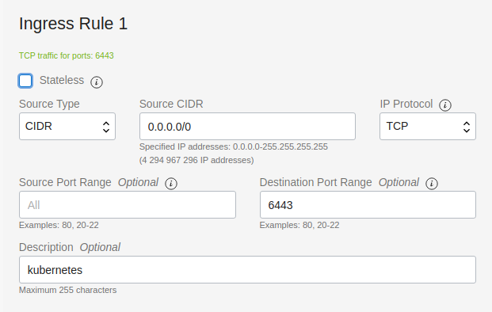

# k8stool

## download
curl -L -o k8stool.zip https://github.com/avclick/k8stool/archive/refs/heads/main.zip && unzip k8stool.zip

## Настройка Networking в oracle cloud

Networking -> Virtual Cloud Networks -> Зайти в сеть vcn-... -> Security Lists -> Зайти в Default Security List for vcn-... -> 

Нажать кнопку "Add Ingress Rules", добавить правило для порта 6443

## Источники
1. https://faun.pub/free-ha-multi-architecture-kubernetes-cluster-from-oracle-c66b8ce7cc37
